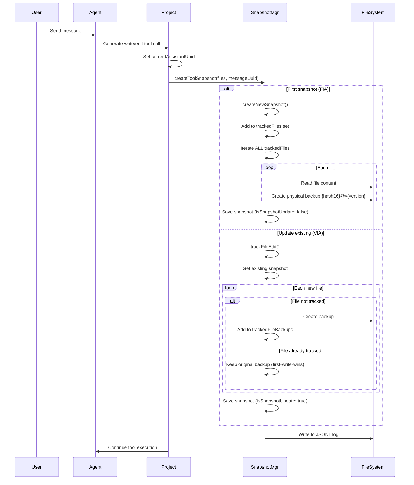
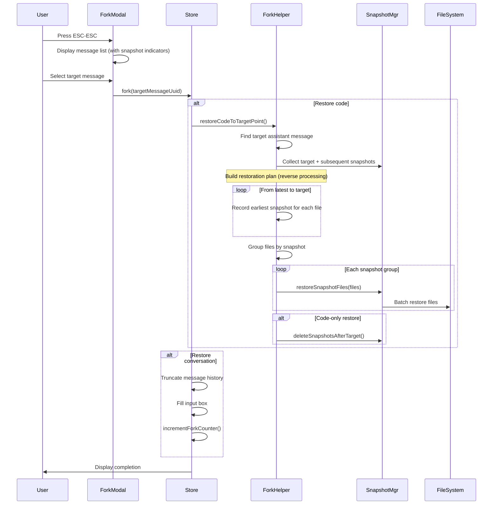
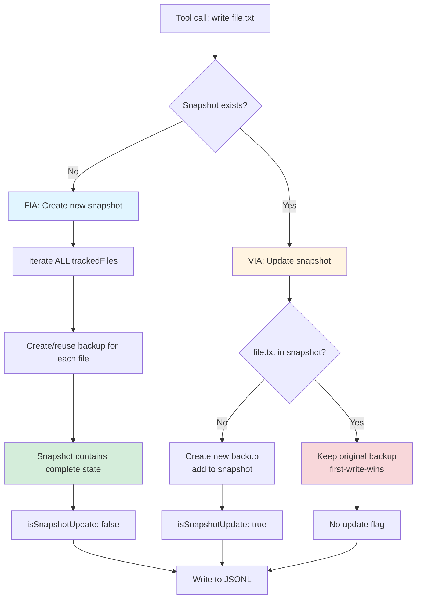

# Fork Code Rollback Feature

## Overview

The Fork Code Rollback feature enhances the existing ESC-ESC fork functionality to support both chat history rollback AND code changes rollback. The system creates snapshots before write/edit tool executions and restores file states when forking to a previous message.

**Status**: ✅ Implemented

## Architecture

### Core Concepts

**Physical Backup System**: Instead of storing file contents inline, the system uses independent physical backup files stored in `~/.neovate/file-history/{sessionId}/`. This approach provides better memory efficiency and enables cross-session backup sharing via hard links.

**Global File Tracking**: The system maintains a `trackedFiles: Set<string>` that records all modified files. Each new snapshot contains the complete state of ALL tracked files, ensuring any time point can be fully restored without depending on previous snapshots.

**Dual Mode Operations**:
- **VIA (Value Incremental Append)**: Updates existing snapshot when the same message triggers multiple tool calls
- **FIA (Full Incremental Append)**: Creates new snapshot with complete state of all tracked files

### Data Structures

```typescript
/**
 * File backup metadata stored in snapshot
 */
interface FileBackup {
  backupFileName: string | null; // null indicates file should be deleted
  version: number;                // Backup version number
  backupTime: string;            // ISO timestamp
}

/**
 * Message snapshot with complete file state
 */
interface MessageSnapshot {
  messageUuid: string;
  timestamp: string;
  trackedFileBackups: Record<string, FileBackup>; // relative path -> backup info
}

/**
 * Snapshot entry for JSONL storage and reconstruction
 */
interface SnapshotEntry {
  snapshot: MessageSnapshot;
  isSnapshotUpdate: boolean; // true=update existing, false=new snapshot
}

/**
 * Snapshot restore operation result
 */
interface RestoreResult {
  filesChanged: string[];
  insertions: number;
  deletions: number;
}
```

**Storage Locations**:
- **Physical backups**: `~/.neovate/file-history/{sessionId}/{hash16}@v{version}`
- **Snapshot metadata**: JSONL log snapshot messages
- **Backup naming**: `{sha256_first16}@v{version}`, e.g., `a3f5c8e92b1d7f6a@v1`

## Implementation

### 1. SnapshotManager (`src/utils/snapshot.ts`)

Core class managing snapshot lifecycle:

```typescript
export class SnapshotManager {
  private snapshots: Map<string, MessageSnapshot> = new Map();
  private snapshotEntries: Map<string, SnapshotEntry> = new Map();
  private trackedFiles: Set<string> = new Set(); // Global tracked files
  private readonly cwd: string;
  private readonly sessionId: string;

  /**
   * Track file edit (VIA mode - update existing or FIA mode - create new)
   */
  async trackFileEdit(
    filePaths: string[],
    messageUuid: string,
  ): Promise<{ snapshot: MessageSnapshot; isUpdate: boolean }>;

  /**
   * Create new snapshot with complete state of all tracked files (FIA mode)
   */
  private async createNewSnapshot(
    filePaths: string[],
    messageUuid: string,
  ): Promise<MessageSnapshot>;

  /**
   * Restore files from snapshot
   */
  async restoreSnapshot(
    messageUuid: string,
    dryRun = false,
  ): Promise<RestoreResult>;

  /**
   * Restore specific files from a snapshot (used during fork)
   */
  async restoreSnapshotFiles(
    messageUuid: string,
    filePaths: string[],
  ): Promise<number>;

  /**
   * Rebuild snapshot state from JSONL entries
   */
  static rebuildSnapshotState(
    snapshotEntries: SnapshotEntry[],
  ): MessageSnapshot[];

  /**
   * Get all tracked files
   */
  getTrackedFiles(): Set<string>;
}
```

**Key Features**:

1. **Global File Tracking**: Maintains a set of all modified files across the session
2. **Version Management**: Each file has incrementing version numbers; unchanged files reuse previous backups
3. **Deduplication**: Compares file content and metadata to avoid redundant backups
4. **Deletion Handling**: Uses `backupFileName: null` to track deleted files

### 2. Snapshot Creation Timing (`src/project.ts`)

Snapshots are created **before** write/edit tool execution to capture the pre-modification state:

```typescript
/**
 * Create snapshot before tool use (captures pre-modification state)
 */
private async createSnapshotBeforeToolUse(toolUse: ToolUse): Promise<void> {
  if (toolUse.name !== TOOL_NAMES.WRITE && toolUse.name !== TOOL_NAMES.EDIT) {
    return;
  }

  if (!this.currentAssistantUuid) {
    return;
  }

  const filePath = toolUse.params.file_path;
  const fullFilePath = pathe.isAbsolute(filePath)
    ? filePath
    : pathe.join(this.context.cwd, filePath);

  const sessionConfigManager = this.getSessionConfigManager();

  try {
    await createToolSnapshot(
      [fullFilePath],
      sessionConfigManager,
      this.currentAssistantUuid,
      this.jsonlLogger || undefined,
    );
  } catch (error) {
    console.error(`[Snapshot] Failed to create snapshot:`, error);
    // Don't throw - continue with tool execution
  }
}

// Called in runLoop's onToolUse callback
onToolUse: async (toolUse) => {
  await this.createSnapshotBeforeToolUse(toolUse);
  // ... continue with tool execution
}
```

### 3. Snapshot Helper Function (`src/utils/snapshot.ts`)

Unified entry point for creating tool snapshots:

```typescript
/**
 * Create tool snapshot - handles memory state, disk storage, and JSONL logging
 */
export async function createToolSnapshot(
  filePaths: string[],
  sessionConfigManager: SessionConfigManager,
  messageUuid: string,
  jsonlLogger?: JsonlLogger,
): Promise<void> {
  const snapshotManager = sessionConfigManager.getSnapshotManager();

  // Use trackFileEdit API to get snapshot and update status
  const { snapshot, isUpdate } = await snapshotManager.trackFileEdit(
    filePaths,
    messageUuid,
  );

  // Save snapshots to disk
  await sessionConfigManager.saveSnapshots();

  // Write to JSONL log (for session resume)
  if (jsonlLogger && Object.keys(snapshot.trackedFileBackups).length > 0) {
    jsonlLogger.addSnapshotMessage({
      messageId: messageUuid,
      timestamp: snapshot.timestamp,
      trackedFileBackups: snapshot.trackedFileBackups,
      isSnapshotUpdate: isUpdate,
    });
  }
}
```

### 4. ForkModal Enhancement (`src/ui/ForkModal.tsx`)

Visual indicator for messages with snapshots:

```typescript
export function ForkModal({
  messages,
  onSelect,
  onClose,
  hasSnapshot,
  snapshotCache, // { [messageUuid]: boolean }
}: ForkModalProps) {
  // ... filter and display user messages

  return (
    <Box flexDirection="column">
      {userMessages.map((message, index) => {
        const messageHasSnapshot =
          snapshotCache && message.uuid && snapshotCache[message.uuid];

        return (
          <Box key={message.uuid}>
            <Text>
              {timestamp} | {preview}
              {messageHasSnapshot && <Text dimColor> (code changed)</Text>}
            </Text>
          </Box>
        );
      })}
    </Box>
  );
}
```

### 5. Fork Operation (`src/ui/store.ts`)

Enhanced fork with independent code and conversation restore control:

```typescript
fork: async (
  targetMessageUuid: string,
  options?: { restoreCode?: boolean; restoreConversation?: boolean },
) => {
  const { bridge, cwd, sessionId, messages } = get();

  const restoreCode = options?.restoreCode ?? true;
  const restoreConversation = options?.restoreConversation ?? true;

  const targetMessage = messages.find(
    (m) => (m as NormalizedMessage).uuid === targetMessageUuid,
  );
  if (!targetMessage) {
    get().log(`Fork error: Message ${targetMessageUuid} not found`);
    return;
  }

  const targetIndex = messages.findIndex(
    (m) => (m as NormalizedMessage).uuid === targetMessageUuid,
  );

  // Code restoration
  if (restoreCode) {
    const shouldDeleteSnapshots = !restoreConversation;

    await restoreCodeToTargetPoint(
      bridge,
      cwd,
      sessionId,
      messages,
      targetIndex,
      targetMessageUuid,
      get().log,
      shouldDeleteSnapshots,
    );
  }

  // Conversation restoration
  if (restoreConversation) {
    restoreConversationToTargetPoint(
      messages,
      targetIndex,
      targetMessage,
      get().history,
      set,
    );
    get().incrementForkCounter();
  } else {
    set({ forkModalVisible: false });
  }
}
```

### 6. Fork Restoration Strategy (`src/ui/utils/forkHelpers.ts`)

**Strategy**: Process snapshots in reverse order (from latest to target) to build file restoration plan:

```typescript
/**
 * Restore code to target message point
 * 
 * Strategy:
 * 1. Find target assistant message (snapshots are linked to assistant messages)
 * 2. Collect target snapshot and all subsequent snapshots
 * 3. Build file restoration plan by processing snapshots in REVERSE order:
 *    - If file appears in target snapshot: use target (pre-modification state)
 *    - If file only in later snapshots: use FIRST (earliest) later snapshot
 * 4. Batch restore files grouped by snapshot
 */
export async function restoreCodeToTargetPoint(
  bridge: UIBridge,
  cwd: string,
  sessionId: string,
  messages: Message[],
  targetIndex: number,
  targetUserUuid: string,
  logFn: (message: string) => void,
  shouldDeleteSnapshots: boolean,
): Promise<void> {
  // 1. Find target assistant message
  const targetAssistantMessage = findTargetAssistantMessage(
    messages,
    targetUserUuid,
  );

  // 2. Collect snapshots
  const snapshotsToProcess = await collectSnapshots(
    bridge,
    cwd,
    sessionId,
    messages,
    targetIndex,
    targetAssistantMessage,
  );

  if (snapshotsToProcess.length === 0) {
    logFn('Fork: No snapshots to restore');
    return;
  }

  // 3. Build file restoration plan (reverse processing)
  const fileRestorationPlan = buildFileRestorationPlan(snapshotsToProcess);

  // 4. Batch restore by snapshot
  const restoreGroups = groupFilesBySnapshot(fileRestorationPlan);
  const totalFilesRestored = await restoreFilesFromSnapshots(
    bridge,
    cwd,
    sessionId,
    restoreGroups,
    logFn,
  );

  logFn(`Fork: Code restored (${totalFilesRestored} file(s) changed)`);

  // 5. Optional: Delete subsequent snapshots (code-only restore)
  if (shouldDeleteSnapshots) {
    await deleteSnapshotsAfterTarget(
      bridge,
      cwd,
      sessionId,
      messages,
      targetIndex,
      logFn,
    );
  }
}

/**
 * Build file restoration plan by processing snapshots in REVERSE order
 */
function buildFileRestorationPlan(
  snapshotsToProcess: SnapshotInfo[],
): Map<string, FileRestorationPlan> {
  const fileRestorationPlan = new Map<string, FileRestorationPlan>();

  // Process from latest to target
  for (let i = snapshotsToProcess.length - 1; i >= 0; i--) {
    const { messageUuid, snapshot, isTarget } = snapshotsToProcess[i];

    for (const filePath of Object.keys(snapshot.trackedFileBackups)) {
      // Always overwrite with earlier snapshot (time travel backwards)
      fileRestorationPlan.set(filePath, {
        messageUuid,
        isFromTarget: isTarget,
      });
    }
  }

  return fileRestorationPlan;
}
```

### 7. SessionConfigManager Integration (`src/session.ts`)

Each session maintains an independent SnapshotManager instance:

```typescript
export class SessionConfigManager {
  private snapshotManager: SnapshotManager | null = null;
  private cwd: string;
  private sessionId: string;
  private logPath: string;

  getSnapshotManager(): SnapshotManager {
    if (!this.snapshotManager) {
      this.snapshotManager = new SnapshotManager({
        cwd: this.cwd,
        sessionId: this.sessionId,
      });

      // Load snapshots from JSONL log
      const entries = this.loadSnapshotEntriesFromLog();
      if (entries.length > 0) {
        this.snapshotManager.loadSnapshotEntries(entries);
      }
    }
    return this.snapshotManager;
  }

  /**
   * Load snapshot entries from JSONL log
   */
  private loadSnapshotEntriesFromLog(): SnapshotEntry[] {
    // Parse snapshot messages from JSONL log
    // ...
    return entries;
  }

  /**
   * Save snapshots (snapshots are written to JSONL via createToolSnapshot)
   */
  async saveSnapshots(): Promise<void> {
    // Snapshots are already written to JSONL log
    // This method is kept for backward compatibility
  }
}
```

### 8. NodeBridge RPC Handlers (`src/nodeBridge.ts`)

```typescript
// Get snapshot info
case 'session.getSnapshot': {
  const { messageUuid } = payload;
  const sessionConfigManager = getSessionConfigManager(cwd, sessionId);
  const snapshotManager = sessionConfigManager.getSnapshotManager();
  const snapshot = snapshotManager.getSnapshot(messageUuid);
  return {
    success: true,
    data: { snapshot },
  };
}

// Restore entire snapshot
case 'session.restoreSnapshot': {
  const { messageUuid, dryRun } = payload;
  const sessionConfigManager = getSessionConfigManager(cwd, sessionId);
  const snapshotManager = sessionConfigManager.getSnapshotManager();
  const result = await snapshotManager.restoreSnapshot(messageUuid, dryRun);
  return {
    success: true,
    data: result,
  };
}

// Restore specific files from snapshot (used in Fork)
case 'session.restoreSnapshotFiles': {
  const { messageUuid, filePaths } = payload;
  const sessionConfigManager = getSessionConfigManager(cwd, sessionId);
  const snapshotManager = sessionConfigManager.getSnapshotManager();
  const restoredCount = await snapshotManager.restoreSnapshotFiles(
    messageUuid,
    filePaths,
  );
  return {
    success: true,
    data: { restoredCount },
  };
}

// Delete snapshot
case 'session.deleteSnapshot': {
  const { messageUuid } = payload;
  const sessionConfigManager = getSessionConfigManager(cwd, sessionId);
  const snapshotManager = sessionConfigManager.getSnapshotManager();
  const deleted = snapshotManager.deleteSnapshot(messageUuid);
  return {
    success: true,
    data: { deleted },
  };
}

// Check if snapshot exists
case 'session.hasSnapshot': {
  const { messageUuid } = payload;
  const sessionConfigManager = getSessionConfigManager(cwd, sessionId);
  const snapshotManager = sessionConfigManager.getSnapshotManager();
  const hasSnapshot = snapshotManager.hasSnapshot(messageUuid);
  return {
    success: true,
    data: { hasSnapshot },
  };
}
```

## Key Design Decisions

### 1. Snapshot Timing: Pre-Modification

Snapshots are created **before** write/edit tool execution to capture the pre-modification state. This ensures:
- Fork restoration returns to the state before modifications
- Tool failures still have snapshot protection
- Intuitive user experience

### 2. Global File Tracking

Each new snapshot contains the **complete state** of ALL tracked files, not just the currently modified files. This ensures:
- Any snapshot can be restored independently
- No dependency on previous snapshots
- Reliable restoration even if earlier snapshots are corrupted

### 3. VIA vs FIA Dual Mode

**VIA (Value Incremental Append)** - Update existing snapshot:
- Same message triggers multiple tool calls
- Maintains first modification's backup (first-write-wins)
- Marked with `isSnapshotUpdate: true`

**FIA (Full Incremental Append)** - Create new snapshot:
- New message creates complete snapshot
- Iterates ALL `trackedFiles` to build complete state
- Marked with `isSnapshotUpdate: false`

Example:
```typescript
// Assistant Message 1
write('A.txt', 'v1')  // FIA: Create new snapshot [A@v1]
write('B.txt', 'v1')  // VIA: Update snapshot [A@v1, B@v1]

// Assistant Message 2
write('A.txt', 'v2')  // FIA: Create new snapshot [A@v2, B@v1] // B reused
```

### 4. Fork Restoration: Reverse Processing

Process snapshots from latest to target in reverse order to determine which snapshot to use for each file:
- File in target snapshot → Use target snapshot
- File only in later snapshots → Use earliest later snapshot
- Ensures correct restoration to target time point

### 5. JSONL Reconstruction

Snapshot updates (VIA) generate multiple snapshot messages. The `rebuildSnapshotState` method correctly reconstructs final state:

```typescript
static rebuildSnapshotState(entries: SnapshotEntry[]): MessageSnapshot[] {
  const rebuiltSnapshots: MessageSnapshot[] = [];
  
  for (const entry of entries) {
    if (!entry.isSnapshotUpdate) {
      // New snapshot: directly append
      rebuiltSnapshots.push(entry.snapshot);
    } else {
      // Update: find and replace original snapshot
      const targetIndex = rebuiltSnapshots.findLastIndex(
        (s) => s.messageUuid === entry.snapshot.messageUuid,
      );
      if (targetIndex !== -1) {
        rebuiltSnapshots[targetIndex] = entry.snapshot;
      }
    }
  }
  
  return rebuiltSnapshots;
}
```

## Performance Optimization

### Storage Efficiency

1. **Physical Backup Files**:
   - Independent storage in `~/.neovate/file-history/{sessionId}/`
   - Naming: `{hash16}@v{version}` (e.g., `a3f5c8e92b1d7f6a@v1`)
   - Typical usage: 20 files × 100 lines ≈ 200KB uncompressed

2. **Deduplication**:
   - Reuses previous backups when file content unchanged
   - Version increments but physical backup can be shared
   - Significantly reduces disk usage (especially in fork scenarios)

3. **JSONL Storage**:
   - Snapshot metadata written to JSONL log (lightweight)
   - Each snapshot message contains `trackedFileBackups` dictionary
   - Supports incremental updates (`isSnapshotUpdate` flag)

4. **Cross-Session Backup Reuse**:
   - Session resume uses hard links to copy backup files
   - Saves disk space and improves restore speed

### Restore Speed

1. **Batch Restore Strategy**:
   - Groups files by snapshot to reduce RPC calls
   - Uses `restoreSnapshotFiles` for batch restoration
   - Avoids per-file restoration overhead

2. **Diff Calculation**:
   - Only restores changed files (skips unchanged)
   - Provides `insertions/deletions` statistics
   - Supports `dryRun` mode for preview

3. **Parallel I/O**:
   - Async file operations don't block UI
   - Read/write uses Node.js async APIs
   - Large file restoration doesn't impact UX

### Memory Usage

1. **Lazy Loading**:
   - SnapshotManager initialized on-demand
   - Backup files not loaded into memory (only metadata)
   - Physical backups read only during restore

2. **Global Tracking Set Optimization**:
   - `trackedFiles: Set<string>` stores only relative paths
   - Typical usage: 20 files × 50 chars ≈ 1KB
   - Rebuilt from existing snapshots on load

3. **Snapshot Entry Management**:
   - `snapshotEntries` only stores recent update status
   - Used for JSONL reconstruction, not persistent
   - Automatically released on session end

### Performance Metrics (Reference)

| Scenario | Files | Total Lines | Disk Usage | Restore Time |
|----------|-------|-------------|------------|--------------|
| Small    | 5     | 500         | ~50KB      | <100ms       |
| Medium   | 20    | 2000        | ~200KB     | ~300ms       |
| Large    | 50    | 5000        | ~500KB     | ~800ms       |

## Testing

### Unit Tests (`src/utils/snapshot.test.ts`)

```typescript
describe('SnapshotManager', () => {
  describe('trackFileEdit', () => {
    it('should create new snapshot for first edit', async () => {
      const manager = new SnapshotManager({ cwd: TEST_DIR, sessionId: TEST_SESSION_ID });
      const { snapshot, isUpdate } = await manager.trackFileEdit([file], messageUuid);

      expect(isUpdate).toBe(false);
      expect(snapshot.trackedFileBackups['test.txt']).toBeDefined();
    });

    it('should accumulate files in same message snapshot', async () => {
      const manager = new SnapshotManager({ cwd: TEST_DIR, sessionId: TEST_SESSION_ID });
      
      await manager.createSnapshot([file1], messageUuid);
      await manager.createSnapshot([file2], messageUuid);
      await manager.createSnapshot([file3], messageUuid);

      const snapshot = manager.getSnapshot(messageUuid);
      expect(Object.keys(snapshot!.trackedFileBackups).length).toBe(3);
    });

    it('should reuse unchanged file backups', async () => {
      const snapshot1 = await manager.createSnapshot([file], uuid1);
      const snapshot2 = await manager.createSnapshot([file], uuid2);

      expect(snapshot1.trackedFileBackups['test.txt'].backupFileName).toBe(
        snapshot2.trackedFileBackups['test.txt'].backupFileName,
      );
    });
  });

  describe('restoreSnapshot', () => {
    it('should restore files from snapshot', async () => {
      await manager.createSnapshot([file], messageUuid);
      writeFileSync(file, 'Modified');
      
      await manager.restoreSnapshot(messageUuid);
      
      expect(readFileSync(file, 'utf-8')).toBe('Original');
    });

    it('should handle deleted files restoration', async () => {
      await manager.createSnapshot([file], messageUuid);
      rmSync(file);
      
      await manager.restoreSnapshot(messageUuid);
      
      expect(existsSync(file)).toBe(true);
    });

    it('should calculate diff statistics', async () => {
      const result = await manager.restoreSnapshot(messageUuid);
      
      expect(result.filesChanged).toContain(file);
      expect(result.insertions).toBeGreaterThan(0);
      expect(result.deletions).toBeGreaterThan(0);
    });
  });

  describe('rebuildSnapshotState', () => {
    it('should rebuild snapshots from entries', () => {
      const entries: SnapshotEntry[] = [
        { snapshot: { messageUuid: 'uuid1', ... }, isSnapshotUpdate: false },
        { snapshot: { messageUuid: 'uuid1', ... }, isSnapshotUpdate: true },
        { snapshot: { messageUuid: 'uuid2', ... }, isSnapshotUpdate: false },
      ];

      const rebuiltSnapshots = SnapshotManager.rebuildSnapshotState(entries);

      expect(rebuiltSnapshots.length).toBe(2); // uuid1 updated, final 2 snapshots
    });
  });

  describe('trackedFiles', () => {
    it('should include all tracked files in new snapshot', async () => {
      await manager.createSnapshot([file1], randomUUID());
      const snapshot2 = await manager.createSnapshot([file2], randomUUID());

      const paths = Object.keys(snapshot2.trackedFileBackups);
      expect(paths).toContain('file1.txt');
      expect(paths).toContain('file2.txt');
    });
  });
});
```

### Integration Tests (`src/session.snapshot.integration.test.ts`)

```typescript
describe('Session Snapshot Integration', () => {
  it('should persist and restore multiple snapshots', async () => {
    const snapshotManager = sessionConfigManager.getSnapshotManager();

    await snapshotManager.createSnapshot([file1, file2], messageUuid1);
    await sessionConfigManager.saveSnapshots();

    writeFileSync(file1, 'v2');
    writeFileSync(file2, 'v2');

    await snapshotManager.createSnapshot([file1, file2], messageUuid2);
    await sessionConfigManager.saveSnapshots();

    // Restore to v1
    await snapshotManager.restoreSnapshot(messageUuid1);
    expect(readFileSync(file1, 'utf-8')).toContain('v1');

    // Restore to v2
    await snapshotManager.restoreSnapshot(messageUuid2);
    expect(readFileSync(file2, 'utf-8')).toContain('v2');
  });

  it('should reload snapshots from JSONL log', async () => {
    // First session: create snapshot
    const snapshotManager1 = sessionConfigManager1.getSnapshotManager();
    await snapshotManager1.createSnapshot([file], messageUuid);

    // Simulate session restart
    const snapshotManager2 = new SessionConfigManager({...}).getSnapshotManager();

    // Should load from log
    expect(snapshotManager2.hasSnapshot(messageUuid)).toBe(true);
  });
});
```

### E2E Test Scenarios

1. **Complete Fork Flow**
   ```
   User message → Assistant response + file modifications → Fork to user message → Verify file restoration
   ```

2. **Multi-Turn Conversation Snapshots**
   ```
   Turn 1: Modify A.txt
   Turn 2: Modify B.txt
   Turn 3: Modify A.txt and C.txt
   Fork to Turn 1 → Verify correct state of A/B/C
   ```

3. **Session Persistence**
   ```
   Create snapshots → Exit session → Resume session → Fork → Verify snapshots still work
   ```

4. **Mixed Scenarios**
   ```
   write tool + edit tool + bash command → Only write/edit create snapshots
   ```

## Migration Guide

### Backward Compatibility

1. **Seamless Upgrade**:
   - Old sessions without snapshots continue to work
   - Fork functionality backward compatible (snapshots optional)
   - No database migration needed

2. **Storage Evolution**:
   - Backup files: `~/.neovate/file-history/{sessionId}/`
   - Metadata: JSONL log snapshot messages
   - Advantages: Better performance, smaller memory footprint, cross-session sharing support

### Upgrade Checklist

- [ ] Confirm Node.js version >= 18
- [ ] Check disk space (typical usage ~100MB/session)
- [ ] Existing sessions auto-compatible, no manual action needed
- [ ] New sessions automatically use physical backup mechanism
- [ ] Fork functionality degrades gracefully to conversation-only rollback without snapshots

### Troubleshooting

**Issue: Backup files not found**
```bash
# Check backup directory
ls ~/.neovate/file-history/{sessionId}/

# Enable debug mode
export NEOVATE_SNAPSHOT_DEBUG=true
```

**Issue: Snapshots not created**
- Verify write/edit tools were used (bash commands don't create snapshots)
- Confirm `currentAssistantUuid` is correctly set
- Check `[Snapshot]` messages in logs

**Issue: Restore failure**
- Verify backup file permissions
- Check disk space
- Confirm relative path conversion is correct

## Flow Diagrams

### Snapshot Creation Flow



### Fork Restore Flow



### VIA vs FIA Decision Flow



## Future Enhancements

### Potential Improvements

1. **Snapshot Diff Viewer**
   - Display file changes between snapshots
   - Git-like diff view
   - Support file-level and content-level comparison

2. **Snapshot History Commands**
   - `/snapshots` - List all snapshots
   - `/snapshot` - Create manual checkpoint
   - `/snapshot:compare <uuid1> <uuid2>` - Compare snapshots

3. **Smart Conflict Resolution**
   - Detect external file modifications
   - Provide merge strategy options
   - Keep conflict backups

4. **Incremental Compression**
   - Use diff-based storage for large files
   - Similar to Git object storage
   - Reduce disk usage

5. **Backup Cleanup Strategy**
   - Periodic cleanup of old session backups
   - Preserve important snapshots (tagged snapshots)
   - Configurable retention policy (time/size limits)

6. **Binary File Support**
   - Skip or special handling for binary files
   - Use file hash instead of content comparison
   - Optional binary file snapshots

7. **Snapshot Tags and Annotations**
   - Users can tag snapshots
   - Mark important milestones
   - Snapshot search and filtering

## References

- Implementation: `src/utils/snapshot.ts`
- Integration: `src/project.ts`, `src/session.ts`
- UI: `src/ui/ForkModal.tsx`, `src/ui/store.ts`
- Helpers: `src/ui/utils/forkHelpers.ts`
- Tests: `src/utils/snapshot.test.ts`, `src/session.snapshot.integration.test.ts`
